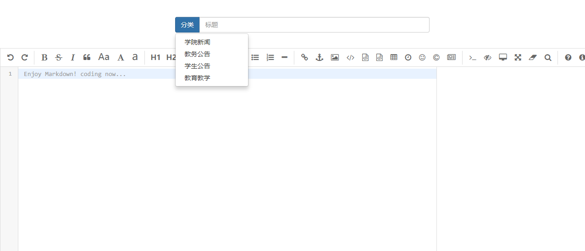

**《数据库设计》实习报告**

**题目：教务公告信息管理系统**

**系 名 计算机科学与技术系**

**专 业 软件工程**

**学 号 

**学生姓名 

**指导教师 

**2018年 9月 13日**

1.  功能设计

2.  需求分析

本系统主要为管理教务公告信息而设计开发，主要功能有发布、修改、删除教务公告信息。分为前台界面和后台管理界面，前台界面主要功能有按照类别浏览教务公告，后台界面主要功能为教务管理员使用，可以进行教务公告按照类别进行编辑并发布，对于发布之后的教务公告可以进行修改或者删除。

2. 开发环境

开发使用软件：

数据库开发软件：Navicat for MySQL

前端代码软件：IntelliJ IDEA 2017.3.5 X64

后台使用软件：IntelliJ IDEA 2017.3.5 X64

开发主要使用语言：Java，JSP

操作系统：

Windows 10 64位

1.  数据库设计

教务公告信息管理系统主要分为三个表，分别为文章表（article）、分类表（category）、用户表（user），表的结构设计如下所示：

文章表（article）

| 列名       | 备注     | 数据类型 | 长度 | 允许空/主键 |
|------------|----------|----------|------|-------------|
| id         | 文章ID   | int      | 11   | 非空/主键   |
| title      | 文章标题 | varchar  | 128  | 非空        |
| content    | 文章内容 | text     | 0    | 非空        |
| categoryid | 分类ID   | int      | 11   | 非空        |
| summary    | 文章摘要 | text     | 0    | 非空        |
| date       | 发布日期 | varchar  | 64   | 非空        |

分类表（category）

| 列名         | 备注     | 数据类型 | 长度 | 允许空/主键 |
|--------------|----------|----------|------|-------------|
| id           | 分类ID   | int      | 11   | 非空/主键   |
| name         | 分类标识 | varchar  | 64   | 非空        |
| display_name | 分类名   | varchar  | 64   | 非空        |

用户表（user）

| 列名     | 备注   | 数据类型 | 长度 | 允许空/主键 |
|----------|--------|----------|------|-------------|
| id       | 用户ID | int      | 11   | 非空/主键   |
| username | 用户名 | varchar  | 64   | 非空        |
| password | 密码   | varchar  | 64   | 非空        |

1.  功能实现

2.  数据库连接

本系统基于Java的SSM框架（Spring、SpringMVC、Mybatis）实现的，由Maven进行构建，数据库采用的是MySQL。数据库连接方面采用的是ORM框架Mybatis，它是一款优秀的持久层框架，支持定制化SQL，存储过程及高级映射，并且避免了几乎所有的JDBC代码和手动设置参数及获取结果集。采用简单的XML或注解方式来配置和映射原生信息，将接口和Java的POJOs映射成数据库中的记录。

数据库连接的关键代码如下：

1.  \@Configuration

2.  \@Component

3.  \@PropertySource(value="classpath:jdbc.properties",encoding="UTF-8")

4.  **public class** DBConfig{

5.  \@Value("\${db.driverClass}")

6.  **public** String driver;

7.  \@Value("\${db.url}")

8.  **public** String url;

9.  \@Value("\${db.username}")

10. **public** String username;

11. \@Value("\${db.password}")

12. **public** String password;

13. \@Value("\${db.initialSize}")

14. **public int** initialSize;

15. \@Value("\${db.maxActive}")

16. **public int** maxActive;

17. \@Value("\${db.maxIdle}")

18. **public int** maxIdle;

19. \@Value("\${db.minIdle}")

20. **public int** minIdle;

21. \@Value("\${db.maxWait}")

22. **public int** maxWait;

23. }

24. 添加功能的实现

添加功能即发布文章功能，由于采用了Mybatis框架，因此我的SQL代码都写在了映射的XML文件中，其中发布文章功能方法名为writeBlog，代码如下：

1.  **\<insert** id="writeBlog"
    parameterType="com.geekerstar.entity.Article"**\>**

2.  INSERT INTO article(title,content,categoryId,summary,date) VALUES
    (\#{title},\#{content},\#{categoryId},\#{summary},\#{date})

3.  **\</insert\>**

以上SQL对应于Article实体，通过INSERT语句将新的文章发布至系统。效果图如下所示：

>   图1. 公告发布界面

文本编辑区我使用了从GitHub上的开源插件editor.md，并通过整合jsp页面应用到了系统中，可以使用Markdown语法进行文章的编写，拥有加粗、删除线、斜体、代码块、实时预览等功能。

点击分类按钮，可以选择“学院新闻”、“教务公告”、“学生公告”、“教育教学”四大板块，然后在标题区输入标题，在文本区输入文本内容，最后点击最下方的发布即可发布教务公告。

1.  修改功能的实现

修改功能即对文章进行修改，在文章管理界面，可以点击修改按钮进行对文章进行修改，其SQL语句如下：

1.  **\<update** id="updateArticleById"
    parameterType="com.geekerstar.entity.Article"**\>**

2.  UPDATE article set
    title=\#{title},content=\#{content},summary=\#{summary},date=\#{date} WHERE
    id=\#{id}

3.  **\</update\>**

修改功能通过UPDATE语句文章表中的内容进行修改，同样在编辑文章窗口对文章进行修改然后发布即可。效果图如下所示：

>   图2. 修改按钮界面

>   图3. 修改编辑界面

1.  删除功能的实现

删除功能在文章列表页点击删除即可，删除功能的SQL语句如下所示：

1.  **\<delete** id="deleteArticleById" parameterType="long"**\>**

2.  DELETE FROM article WHERE id=\#{id}

3.  **\</delete\>**

使用DELETE语句将删除相应的主键ID就可以实现删除功能了。修改功能界面和上图所示一样。

1.  查询功能的实现

查询功能比较复杂，分为后台查询和前台展示，后台查询功能是为了方便管理员进行教务公告的管理，而前台查询功能是为了让教师和学生能够查看教务公告。以下是SQL代码：

1.  //根据ID查询文章信息

2.  **\<select** id="getArticleById"
    resultType="com.geekerstar.entity.Article"**\>**

3.  select \* from article a where id = \#{id}

4.  **\</select\>**

5.  //查询文章（输出到首页的文章信息）

6.  **\<select** id="getFirst10Article"
    resultType="com.geekerstar.entity.Article"**\>**

7.  select a.\*,c.name as category from article a,category c WHERE
    a.categoryId=c.id limit 10

8.  **\</select\>**

9.  **\<resultMap** id="categoryType"
    type="com.geekerstar.entity.Category"**\>**

10. **\<result** property="displayName" column="display_name"**/\>**

11. **\</resultMap\>**

12. //获取分类信息（首页展示分类信息）

13. **\<select** id="getCategories" resultMap="categoryType"**\>**

14. SELECT \* FROM category

15. **\</select\>**

16. //根据分类名获得分类ID

17. **\<select** id="getCategoryIdByName" parameterType="string"
    resultType="long"**\>**

18. SELECT id FROM category WHERE name=\#{name}

19. **\</select\>**

20. //根据ID获取所有分类信息

21. **\<select** id="getCategoryById" parameterType="long"
    resultMap="categoryType"**\>**

22. SELECT \* FROM category WHERE id=\#{id}

23. **\</select\>**

24. //根据分类名获得分类下的文章（首页点击分类名操作）

25. **\<select** id="getArticlesByCategoryName" parameterType="long"
    resultType="com.geekerstar.entity.Article"**\>**

26. SELECT a.\*,c.name as category FROM article a,category c WHERE
    a.categoryId=c.id AND categoryId=\#{categoryId}

27. **\</select\>**

下面是查询效果预览图：

1.  总结

通过实习……

>   图4. 首页

图5. 查看公告内容

图6. 分类查询列表

图7. 管理员公告管理列表

四．总结

通过本次实习，我回顾了数据库的基础知识，增强了对Java的SSM框架的理解，尤其是对Mybatis有了更进一步的认识，数据库对于任何程序员都是非常重要的知识，也是工作中使用非常频繁的技术，对于以后就业面试也是非常有帮助的。
